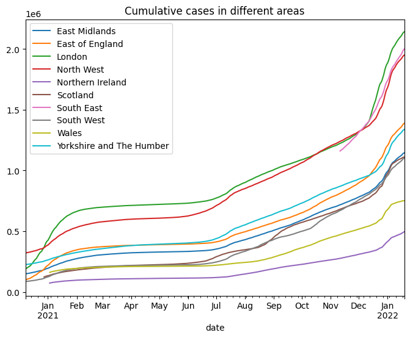
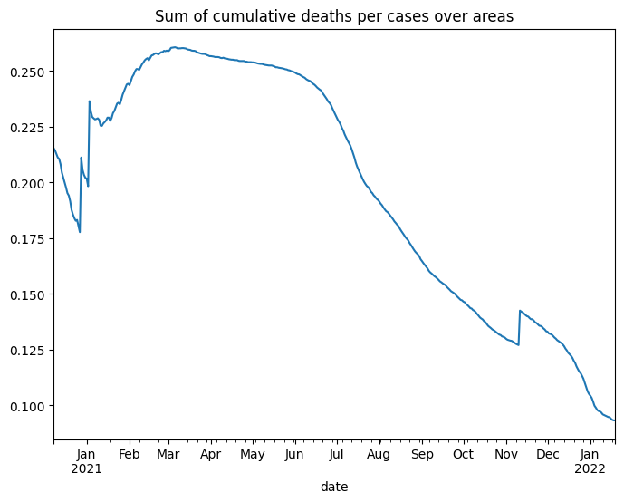
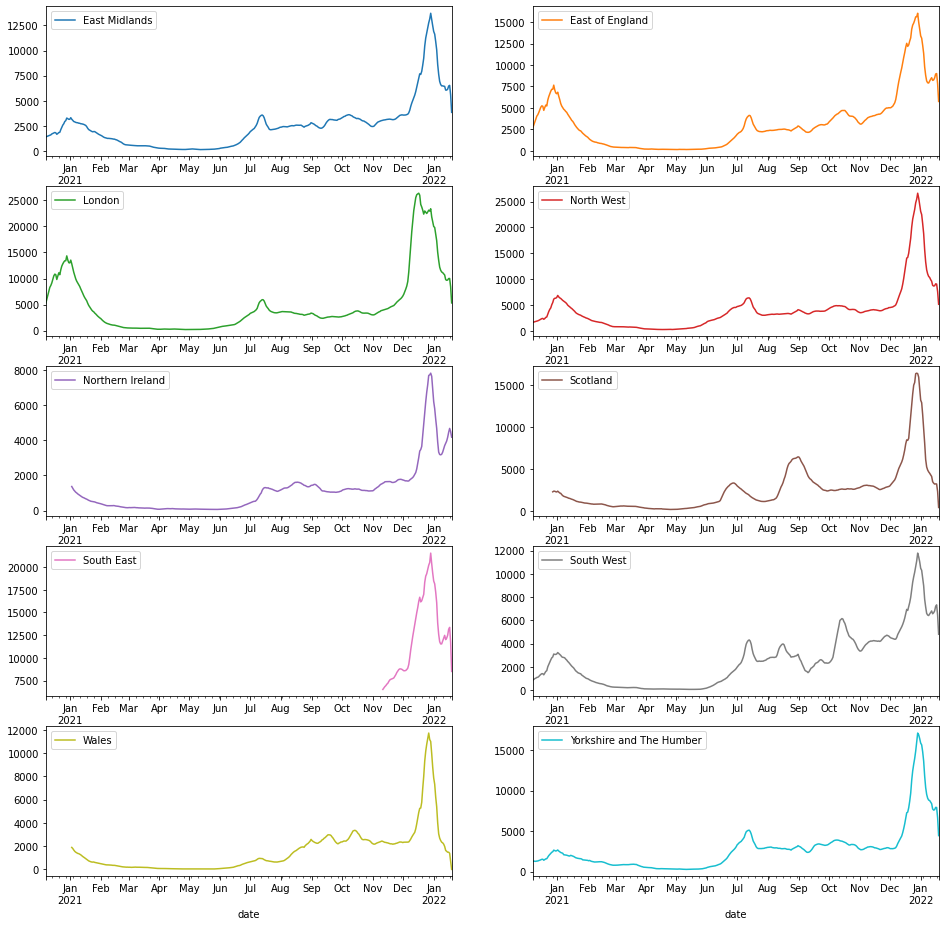
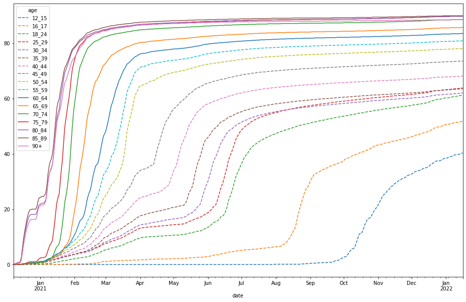
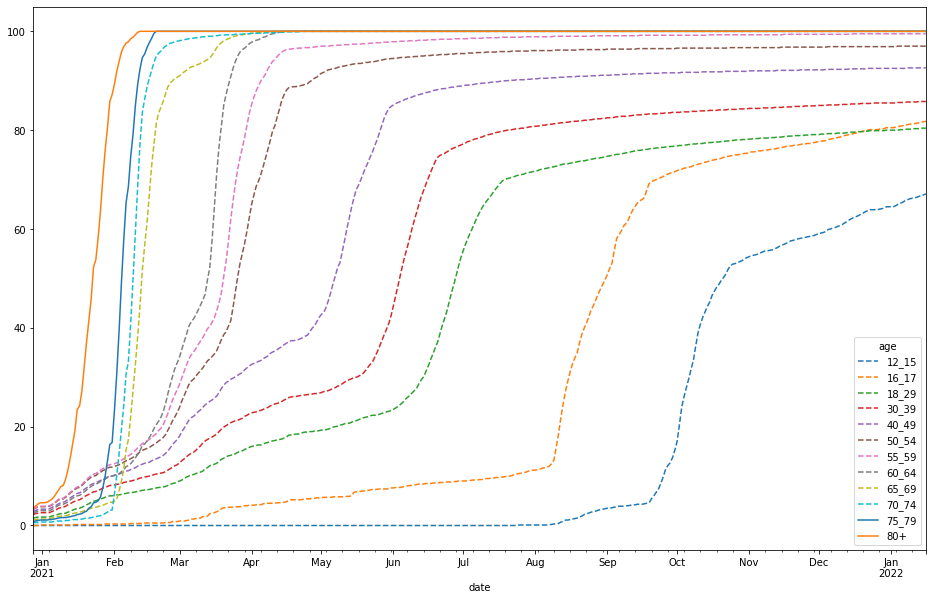

# UK Covid-19 Analysis
This is a practice of analysing the Covid-19 pandemic in the UK. Data is accquired from the [API of the UK government][1]. The visualizations are basic without render, which are only used to present the idea. 

Here we only show some of the visualizations in this study. The complete figures and code can be found in the jupyter notebook.

## Cumulative cases in different areas

As shown in the figure, the cumulative cases in these areas share the similar patterns although different values are shown in different areas. The cumulative cases in these areas all have been through a stable period from Feb. to Jul. They all started to increase since Aug. In June-July, the UK goverment moved to the Step 4 of their lockdown plan. Most limits on social contact are removed. This action can justify the trend of cumulative cases after July. 

## Sum of cumulative deaths per cases over areas

Since March 2021, the value of the indicator (the sum of cumulative deaths per cases over all areas) has been declining. A potential explanation is that the vaccination played an important role. Covid became less lethal to human bodies after a large amount of people in th UK get the vaccines.

## Daily cases rolling average

## Percentage of first dose vaccination in London

All age groups are not vaccinated equally at the same time. In the figure, curve of high age groups first reaches 80% and becomes stable, which means that vaccines were initially distributed based on age. Older people are given priority to get vaccinated. This strategy was carried out because the virus is more harmfull to older people.

## Percentage of first dose vaccination in Scotland

In Scotland, the vaccination percentage of age group 65-79 was lower than the lower age groups before Feb. In fact before Feb, the vaccination percentage of age group 50-64 was higher than other age groups except 80+. The vaccination percentage of age group 65-79 started to rise and overtook those in the lower age groups after Feb.

[1]: https://coronavirus.data.gov.uk/details/developers-guide/main-api